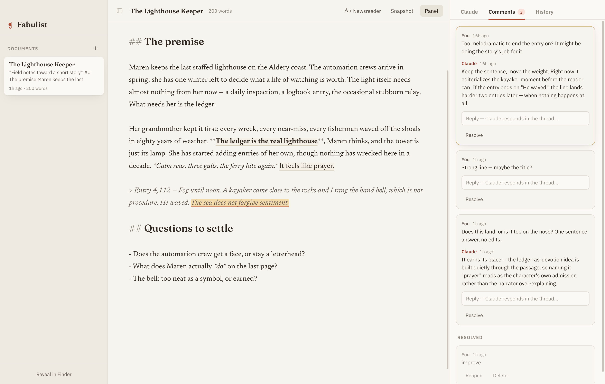
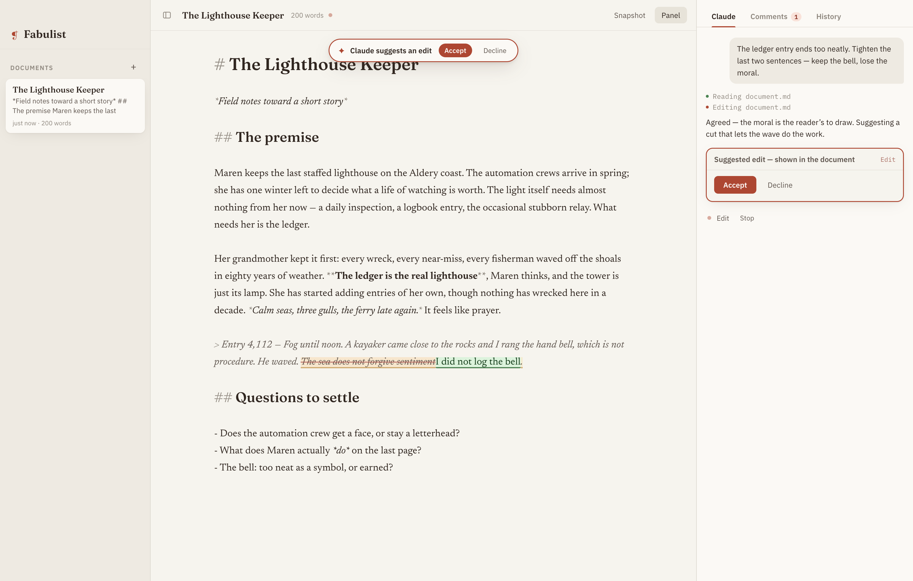
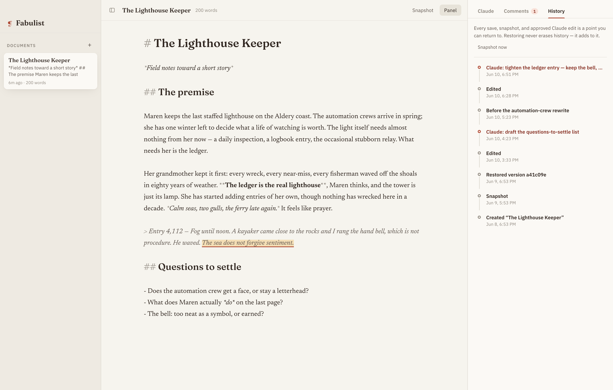

# Fabulist

**An AI-native writing studio for the desktop, powered under the hood by [Claude Code](https://claude.com/claude-code).**

Every document is a real Claude Code project folder — versioned with git, rewindable, and
shared with an agent that works *inside* the document's world. You write directly, or you
highlight, comment, and ask Claude. Every change Claude proposes is shown to you as a diff
that you approve or decline before it touches the text.



**Every edit Claude proposes appears in the document as a suggested edit — strikethrough and insertion, accept or decline:**



**Every save, snapshot, and approved edit is a point you can return to:**



## Features

- **A real editor first** — CodeMirror 6 markdown editing with manuscript typography. Your
  words live in a plain `document.md` you can open with anything.
- **An agent that knows the document** — chat in the sidebar; Claude reads, researches, and
  edits the doc with full project context (each doc has its own `CLAUDE.md` it loads).
  Per-document model picker, populated live from whatever your Claude Code version offers.
- **Human-approved edits** — Claude's proposed changes render in the document itself as
  Google-Docs-style suggested edits (strikethrough + insertion), with accept/decline
  (⌘⏎ / esc). Commands and non-document files surface as diff cards in chat. Nothing
  reaches the document without your explicit approval.
- **Comments like a shared doc** — highlight text, start anchored threads that survive edits
  and rewrites. Ask Claude to weigh in on a thread; its reply lands in the thread and any
  proposed fix goes through the approval gate.
- **Versioned and rewindable** — autosave checkpoints, named snapshots, and automatic commits
  for every approved Claude edit. Preview any version as a diff and restore it; restores
  commit forward, so history is never destroyed.

## Requirements

- macOS (Windows/Linux likely work — packaging targets exist — but are untested)
- [Node.js](https://nodejs.org) 20+
- `git` on your PATH
- A logged-in **Claude Code** installation — Fabulist uses your existing `claude` login
  and plan; it never asks for an API key

## Run it

```bash
git clone <this repo> fabulist && cd fabulist
npm install
npm run dev
```

> If your npm config disables postinstall scripts, run `node node_modules/electron/install.js`
> once to fetch the Electron binary.

Build a standalone app (`.dmg`/`.zip` into `dist/`):

```bash
npm run dist
```

Your documents live in `~/Documents/Fabulist/`, one folder per document:

```
~/Documents/Fabulist/<document>/
  document.md        ← the document itself
  CLAUDE.md          ← per-document instructions Claude loads automatically
  comments.json      ← anchored comment threads (versioned with the doc)
  .fabulist/         ← app state: agent session id, chat transcript (gitignored)
  .git/              ← full version history
```

## How it works

| Layer | Choice | Why |
|---|---|---|
| Shell | Electron + electron-vite + React | The Claude Agent SDK is a Node library; running it in the main process is the most direct integration possible — no sidecar, no server. |
| Editor | CodeMirror 6 (markdown) | Baremetal; its decoration/range-mapping API powers comment highlights that survive edits. |
| Agent | `@anthropic-ai/claude-agent-sdk` | The actual Claude Code engine. `cwd` = the doc folder, `resume` keeps one continuous session per document, `settingSources: ['project']` loads the doc's CLAUDE.md. |
| Versioning | plain `git` CLI per doc folder | History = `git log`, rewind = restore from a rev (always committed forward — restoring never erases history). |
| Approval gate | SDK `canUseTool` callback | Read-only tools pass through; file edits and commands surface as inline diff cards the author must approve. `comments.json` is app-managed and off-limits to the agent. |

### The approval flow

1. Claude calls `Edit`/`Write` on a file → `canUseTool` fires in the main process.
2. Main computes before/after, sends a permission request over IPC.
3. For the document itself, the editor renders the change inline as a suggested edit
   (old text struck through, new text inserted) and locks the doc while you review;
   commands and other files show as diff cards in the chat panel.
4. On accept, the SDK executes the edit; a file watcher picks up the change and the
   editor updates live; the turn ends with an automatic `Claude: <prompt>` commit.

## Privacy

Everything is local: your documents, comments, history, and chat transcripts stay in
`~/Documents/Fabulist/`. Conversations with Claude go through your own Claude Code
login, exactly as if you'd run `claude` in that folder yourself.

## Development

- `npm run typecheck` — strict TS over main + renderer
- `npm run build` — production bundles to `out/`
- `npm run pack` — unpacked app build for quick smoke tests (`dist/`)
- `scripts/cdp.mjs` — dev harness: launch with
  `npm run dev -- -- --remote-debugging-port=9223`, then
  `node scripts/cdp.mjs screenshot /tmp/app.png` or `node scripts/cdp.mjs eval '<js>'`
  (the renderer exposes `window.__store` in dev builds)

Source map:

```
src/main/        Electron main: window, IPC, git, library, comments store,
                 agent.ts (the Claude Code bridge + approval gate)
src/preload/     typed contextBridge API (window.fabulist)
src/shared/      types shared across processes
src/renderer/    React app: Library rail · CodeMirror editor (comment
                 decorations, selection toolbar) · sidebar (Claude chat with
                 approval cards / comment threads / history timeline)
```

See [CONTRIBUTING.md](CONTRIBUTING.md) before opening a PR.

## License

[MIT](LICENSE)
